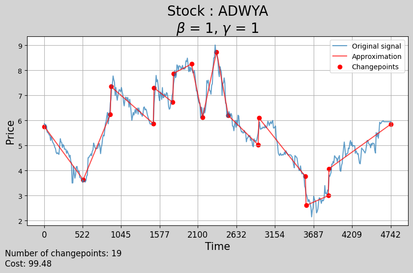

# CPOP

Project for the course "Time Series" of the MVA master at ENS Paris-Saclay.

Paper : [Detecting changes in slope with an L0 penalty](https://arxiv.org/pdf/1701.01672.pdf), Robert Maidstone, Paul Fearnhead, Adam Letchford, 2017.

<p align="middle">
  
</p>

This project implements in python the CPOP (Continuous-piecewise-linear Pruned Optimal Partitioning) algorithm proposed in the paper above to detect changepoints in a univariate time series using a continuous piecewise linear model and an L0 penalty.

The authors made their code (in R and C++) available, but we decided to implement the algorithm from scratch in python to better understand it and to make it easier to use.

## Usage
Detect changepoints in a univariate time series using the CPOP algorithm :
```python
import numpy as np

from src import CPOP, LogCost

y = np.random.normal(size=100, scale=1)

changepoints = CPOP(y=y, beta=2 * np.log(len(y)), h=LogCost(1), sigma=1, verbose=True)
```

## Report

The report is available [here](report/report.pdf).

## Code

The main code is available in the `src` folder. It contains an implementation of the CPOP algorithm in Python. The notebook `experiments.ipynb` contains the experiments we ran to test the algorithm.

## TO DO

- [x] Implement the CPOP algorithm in Python
- [x] Implement the pruning steps
- [x] Debug and optimize the algorithm
- [ ] Update the tests
- [ ] Add tests for the core functions (coefficients computation and pruning)
- [ ] Optimize memory usage when storing current segmentations

## Contributors

[@bastienlc](https://github.com/bastienlc),
[@s89ne](https://github.com/s89ne)
